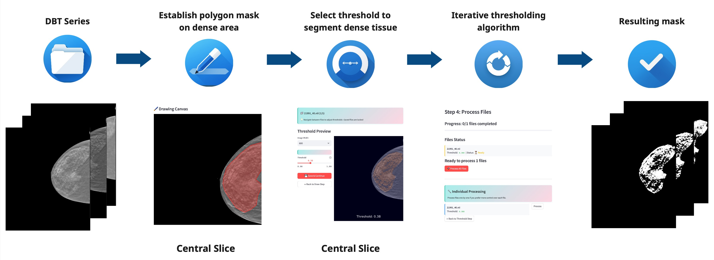

# Density Segmentation GUI

**A beginner-friendly web application for density-based segmentation of medical images (NIfTI format).**

---

## Project Overview

Density Segmentation GUI is an interactive web-based tool for segmenting digital breast tomosynthesis (DBT) images. It builds on [Tamerlan Mustafaev's](https://github.com/RadioTamerlan) segmentation algorithm and provides an intuitive interface for selecting files, drawing masks, adjusting thresholds, and processing results

<p align="center">
  
</p>

**Key features:**
- Step-by-step workflow for batch or single-file segmentation
- Interactive mask drawing on image slices
- Real-time threshold adjustment and preview
- Batch processing and organized output
- No coding required

---

## Quick Start

### 1. Requirements
- Python 3.10+
- Windows, macOS, or Linux
- At least 4GB RAM (8GB+ recommended for large datasets)


### 2. Installation
Clone the repository and set up a virtual environment. You can either set up with **pip/venv** or with **uv**.
The steps are slightly different for Windows and macOS/Linux:

#### **For macOS/Linux:**
```bash
git clone https://github.com/V-kr0pt/density_segmentation_gui.git
cd density_segmentation_gui
python -m venv venv
source venv/bin/activate
pip install -r requirements.txt
```

If you have [uv](https://docs.astral.sh/uv/) installed, setup is even simpler:
```bash
git clone https://github.com/V-kr0pt/density_segmentation_gui.git
cd density_segmentation_gui
uv sync
```
#### **For Windows (Command Prompt):**
```cmd
git clone https://github.com/V-kr0pt/density_segmentation_gui.git
cd density_segmentation_gui
python -m venv venv
venv\Scripts\activate
pip install -r requirements.txt
```

#### **For Windows (PowerShell):**
```powershell
git clone https://github.com/V-kr0pt/density_segmentation_gui.git
cd density_segmentation_gui
python -m venv venv
.\venv\Scripts\Activate.ps1
pip install -r requirements.txt
```

### 3. Launch the App

After activating your virtual environment, start the application:

```bash
streamlit run src/app.py
```

Or to launch the app with uv:
```bash
uv run streamlit run src/app.py
```

The app will open in your browser at [http://localhost:8501](http://localhost:8501).

---

## How It Works: The Workflow

The app guides you through four main steps:

1. **Select Files**
	- Place your Nifti (`.nii`, `.nii.gz`) or Dicom (`.dcm`, `.dicom`) files in the `media/` folder.
	- Use the app to select one or more files for processing.

2. **Draw Masks**
	- For each selected file, use the interactive canvas to draw regions of interest (masks) on image slices.
	- Adjust drawing parameters (brush size, color, etc.) as needed.
	- Save your mask to continue.

3. **Adjust Thresholds**
	- Fine-tune segmentation by adjusting the threshold value using a number input field.
	- Instantly preview how the threshold affects the mask.
	- Save the optimal threshold for each file.

4. **Process & Export**
	- Run the segmentation pipeline for all selected files.
	- The app generates output masks, metadata, and visualizations in the `output/` folder.

---

## Input & Output Structure

**Input:**
```
media/
├── scan1.nii
├── scan2.nii
└── ...
```

**Output:**
```
output/
├── scan1/
│   ├── dense.nii           # Density mask
│   ├── mask.json           # Mask metadata
│   └── dense_mask/
│       ├── mask.nii        # Final processed mask
│       ├── slice_0_*.png   # Slice visualizations
│       └── ...
└── ...
```

---

## Project Structure

```
src/
├── app.py                # Main Streamlit app (controls workflow)
├── file_selection_step.py # File selection logic
├── batch_draw_step.py     # Mask drawing step
├── batch_threshold_step.py# Threshold adjustment step
├── batch_process_step.py  # Processing/export step
├── utils.py               # Utility functions
static/                    # CSS styles
media/                     # Input files
output/                    # Results
```

---

## Frequently Asked Questions

**Q: The app doesn't start or shows an error.**  
A: Make sure you have installed all dependencies.  
- If you used pip/venv, activate your environment and run `pip install -r requirements.txt`.  
- If you used uv, just run `uv sync` to ensure everything is installed.

**Q: My files don't appear in the app.**  
A: Place your input files in the `media/` folder before starting the app.  
The application supports the following formats:
- NIfTI: `.nii`, `.nii.gz`  
- DICOM: `.dcm`, `.dicom`

**Q: How do I start the app if I used uv?**  
A: Instead of activating a virtual environment, just run:  
```bash
uv run streamlit run src/app.py
```

---

## Dependencies

- [Streamlit](https://streamlit.io/) (web interface)
- [NiBabel](https://nipy.org/nibabel/) (NIfTI file handling)
- [NumPy](https://numpy.org/) (numerical operations)
- [Matplotlib](https://matplotlib.org/) (visualization)
- [OpenCV](https://opencv.org/) (image processing)
- [Pillow](https://python-pillow.org/) (image processing)
- [streamlit-drawable-canvas](https://github.com/andfanilo/streamlit-drawable-canvas) (drawing masks)

---

## Acknowledgments

- Built with [Streamlit](https://streamlit.io/) for the web interface
- Medical image processing powered by [NiBabel](https://nipy.org/nibabel/)
- Interactive drawing capabilities provided by [streamlit-drawable-canvas](https://github.com/andfanilo/streamlit-drawable-canvas)